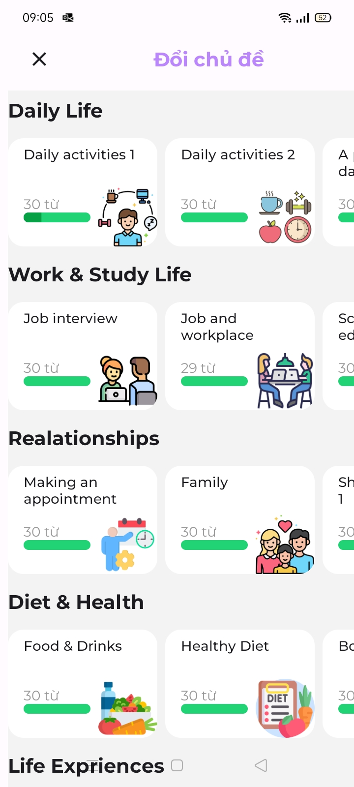
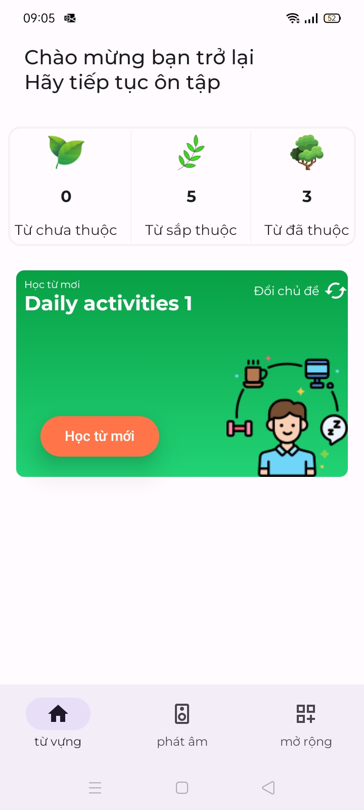
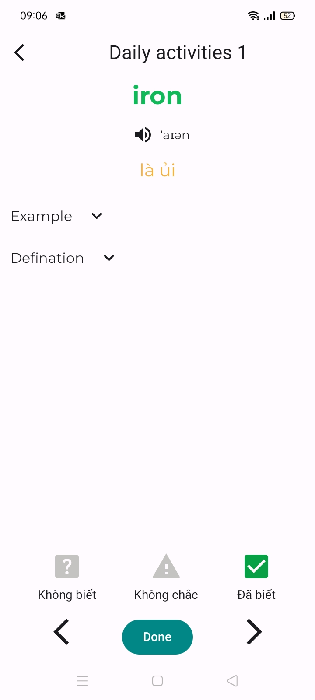
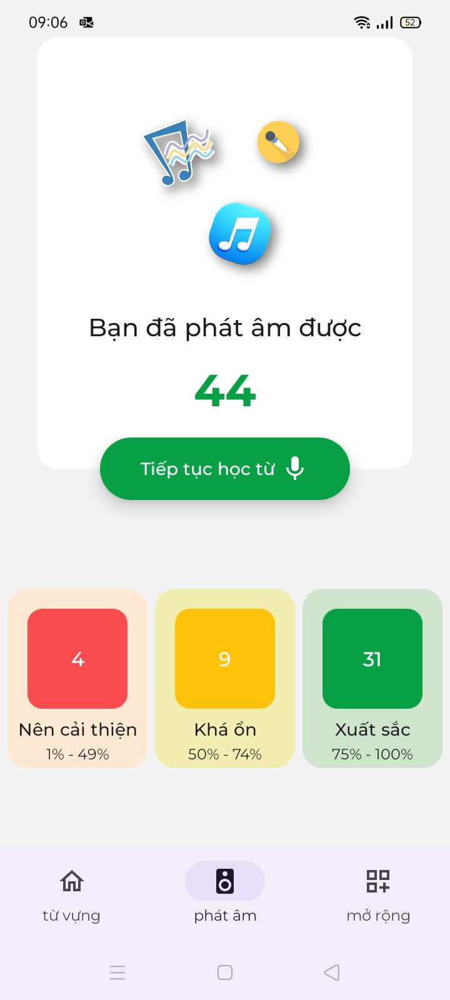
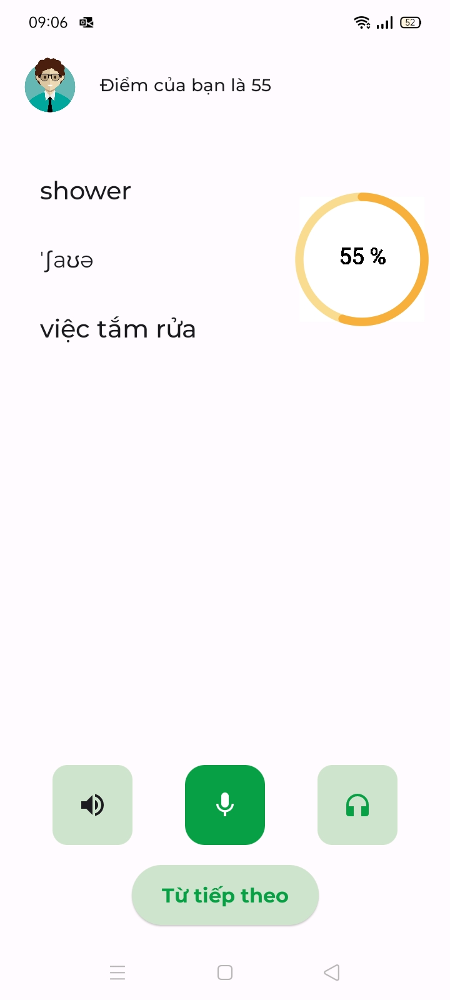
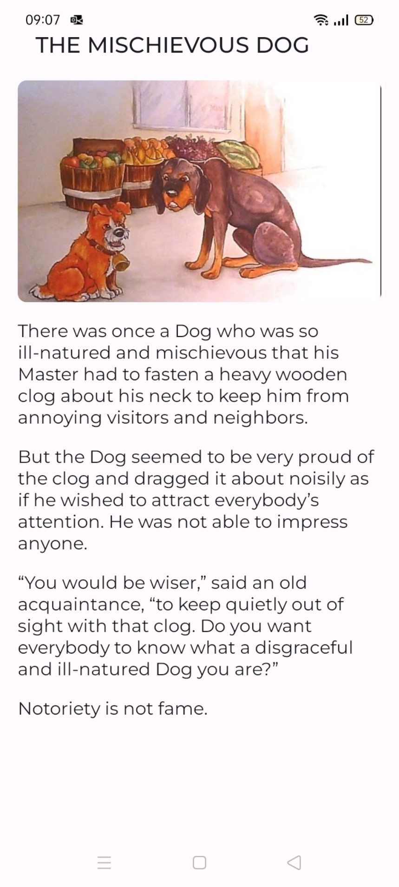
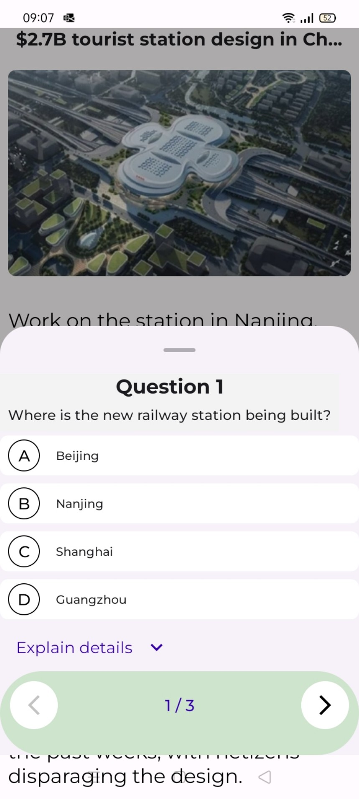
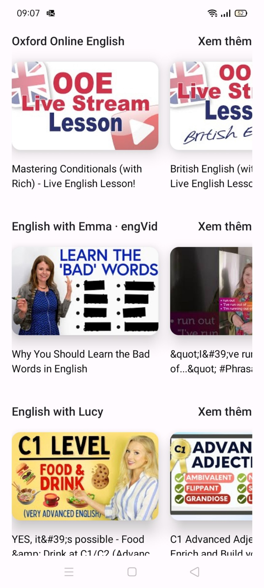
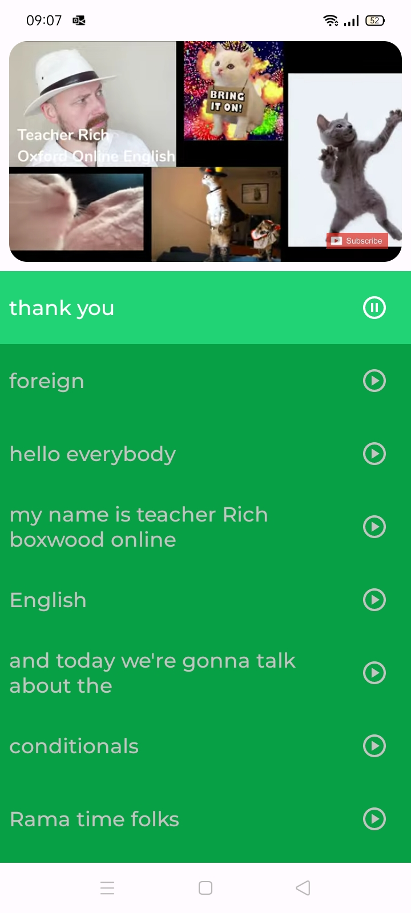

# Learning English
## This is an Android application written in Kotlin with the following features:
### 1. Learn vocabulary and review daily with a variety of topics.
| Topic          | Home                        | Learning                       |
| --------------| ------------------------------| ------------------------------ |
|  |  |      |

### 2. Learn pronunciation with words and phrases.
- To use the pronunciation assessment feature, you need to add an API key to your project. In this case, we're using Azure's pronunciation assessment API.

|                         |                        |
| ----------------------- | ---------------------- |
|   |  |

### 3. Various practice functions for different learning styles.

- Practice reading with articles and fables.

|           |                         |                        |
| --------------| ------------------------------| ------------------------------ |
|  |  |      |
  
-Practice listening with popular YouTube channels.

|                             |                           |
| --------------------------- | ------------------------- |
|      |       |